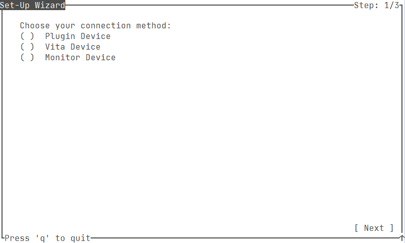

# XLink Handheld Assistant - How to use
For XLink Handheld Assistant there are a few modes the assistant can run in, namely:

- Monitor mode (only on Linux)
- Plugin mode (only for PSP)

These modes have their own upsides and downsides which will be explained below.

- Monitor mode: can only be used on Linux and is generally less reliable than the Plugin mode, its reliability highly depends on the WiFi card used and how busy the WiFi space is in general. The upside of Monitor mode is that it also works on Playstation Vita games, and hopefully in the future more devices as well.
- Plugin mode: can be used on both Windows and Linux, however it only works on PSP games (PSP or Vita using Adrenaline) and needs a plugin to be enabled on the respective device, so the device needs to be modded (CFW/HEN) as well.

\
Follow one of the following guides depending on your chosen method and operating system:

- [Linux - Monitor Mode][]
- [Linux - Plugin Mode][]
- [Windows - Plugin Mode][]

For a general description of all the functions in XLink Handheld Assistant, check [General Overview][].

\newpage
## Linux - Monitor Mode
1. Set the PSP to channel 1, by going to: \
   Settings -> Network Settings -> Ad Hoc Mode -> Ch 1.
2. Start a game on the PSP.
3. Run the following to set the WiFi interface to monitor mode. \
\
**NOTE:** This does disable NetworkManager, if another WiFi connection is used to connect to the internet, it might be better to make NetworkManager ignore the WiFi adapter used for XLHA and edit the "set_interface_monitor" script to not disable NetworkManager. \

    ```bash
    sudo chmod 775 ./linux_scripts/set_interface_monitor.sh \
    && ./linux_scripts/set_interface_monitor.sh "Name of Wifi adapter"
    ```

4. Start [XLink Kai](http://teamxlink.co.uk/) on the PC
    1. Follow steps on [XLink Kai Debian Guide](https://repo.teamxlink.co.uk/) or download the binary from the [download page](https://www.teamxlink.co.uk/go?c=download), after downloading (only when not using the Debian guide): 
    
       ```bash
       tar xvf kaiEngine-*.tar.gz \
       && cd "$(ls -f | grep kaiEngine | grep -v *.tar.gz)" \
       && sudo chmod 755 ./kaiengine \
       && sudo setcap cap_net_admin,cap_net_raw=eip ./kaiengine \
       && ./kaiengine
       ```
5. Start XLink Handheld Assistant 
   ```bash
   sudo chmod 755 ./xlinkhandheldassistant \
   && sudo ./xlinkhandheldassistant
   ```
   
   Apologies about the sudo rights on monitor mode, but it is impossible to do this not as root user as far as I have found.
   
   If you get an error about terminal size at this point, make sure your terminal is atleast of size 80x24.
   Example: Terminal size too small: 46x18, make sure the terminal is at least 80x24
   
6. In the wizard select "Monitor Device" and then use the arrow keys to move down to the "Next" button and press enter.
7. Press space on "Automatically connect to PSP/Vita networks".
8. Move down to "Acknowledge data packets" try enabling this option first, but disable it if you have any issues! If you have an Intel WiFi-Chip, definitely leave this option disabled.
9. Move down to the right network adapter with the arrow keys and press space on the WiFi adapter to be used for XLHA.
10. Move to "Next" button and press enter.
11. Press enter on the "Next" button again.
12. In the Dashboard if you're hosting press space on "Hosting", else just move to the next step.
13. Press enter on "Start Engine".
14. Enter the arena on XLink Kai you want to play on [WebUI](http://127.0.0.1:34522/)
15. On the PSP side go into the multiplayer menu start hosting/joining a game.
16. In the top right-corner of the Dashboard "Connected to PSP_GameID_...." should appear after 5-30 seconds.
17. In XLink Kai click on metrics and scroll down, you should see the following:
{ width=100% }
(There is an XLHA device in Connected Applications, the PSP shows up in Found Consoles, and you see Broadcast Traffic out).
18. Enjoy the game!
19. To stop XLHA, simply press 'q' on the Dashboard.
20. Run the following to restore your WiFi-card to the normal situation:

    ```bash
    sudo chmod 775 ./linux_scripts/restore_managed.sh \
    && ./linux_scripts/restore_managed.sh "Name of Wifi adapter"
    ```

\
If you want to redo these steps or choose another connection method, go into "Options" -> "Reconfigure the application"

\newpage
## Linux - Plugin Mode
1. Copy [AdHocRedirectorWiFi.prx](./Plugin/AdHocRedirectorWiFi.prx) to /SEPLUGINS on the PSP.
2. Create or open /SEPLUGINS/GAME.TXT.
3. Add 

   ```ms0:/seplugins/AdHocRedirectorWiFi.prx 1``` (for PSP 1000/2000/3000) 

   or 

   ``` ef0:/seplugins/AdHocRedirectorWiFi.prx 1``` (for PSP GO)
\
   ```bash
   touch /media/username/nameofPSP/SEPLUGINS/GAME.TXT \
   && echo "ms0:/seplugins/AdHocRedirectorWiFi.prx 1" \
   >> /media/username/nameofPSP/SEPLUGINS/GAME.TXT
   ```
   
4. Start a game on the PSP.
5. Run the following to set the wifi interface to ad-hoc mode. \
\
**NOTE:** This does disable NetworkManager, if another WiFi connection is used to connect to the internet, it might be better to make NetworkManager ignore the WiFi adapter used for XLHA and edit the "set_interface_bss" script to not disable NetworkManager. \

    ```bash
    sudo chmod 775 ./linux_scripts/set_interface_bss.sh \
    && ./linux_scripts/set_interface_bss.sh "Name of Wifi adapter"
    ```

6. Start [XLink Kai](http://teamxlink.co.uk/) on the PC
    1. Follow steps on [XLink Kai Debian Guide](https://repo.teamxlink.co.uk/) or download the binary from the [download page](https://www.teamxlink.co.uk/go?c=download), after downloading (only when not using the Debian guide): 
    
       ```bash
       tar xvf kaiEngine-*.tar.gz \
       && cd "$(ls -f | grep kaiEngine | grep -v *.tar.gz)" \
       && sudo chmod 755 ./kaiengine \
       && sudo setcap cap_net_admin,cap_net_raw=eip ./kaiengine \
       && ./kaiengine
       ```
7. Start XLink Handheld Assistant 
   ```bash
   sudo chmod 755 ./xlinkhandheldassistant \
   && sudo setcap cap_net_admin,cap_net_raw=eip ./xlinkhandheldassistant \
   && ./xlinkhandheldassistant
   ```
   If you get an error about terminal size at this point, make sure your terminal is atleast of size 80x24.
   Example: Terminal size too small: 46x18, make sure the terminal is at least 80x24
   
8. In the wizard select "Plugin Device" and then use the arrow keys to move down to the "Next" button and press enter.
9. Press space on "Automatically connect to PSP networks".
10. Move down to the right network adapter with the arrow keys and press space on the WiFi adapter to be used for XLHA.
11. Move to "Next" button and press enter.
12. Press enter on the "Next" button again.
13. In the Dashboard if you're hosting press space on "Hosting", else just move to the next step.
14. Press enter on "Start Engine".
15. Enter the arena on XLink Kai you want to play on [WebUI](http://127.0.0.1:34522/)
16. On the PSP side go into the multiplayer menu start hosting/joining a game.
17. In the top right-corner of the Dashboard "Connected to PSP_GameID_...." should appear after 5-30 seconds.
18. In XLink Kai click on metrics and scroll down, you should see the following:
{ width=100% }
(There is an XLHA device in Connected Applications, the PSP shows up in Found Consoles, and you see Broadcast Traffic out).
19. Enjoy the game!
20. To stop XLHA, simply press 'q' on the Dashboard.
21. Run the following to restore your WiFi-card to the normal situation:

    ```bash
    sudo chmod 775 ./linux_scripts/restore_managed.sh \
    && ./linux_scripts/restore_managed.sh "Name of Wifi adapter"
    ```

\
If you want to redo these steps or choose another connection method, go into "Options" -> "Reconfigure the application"

\newpage
## Windows - Plugin Mode
**Note:** On Windows 10 there are quite a few WiFi cards that will only work with Windows 7 or older drivers, if the program will not connect to networks after following these steps, try to downgrade the driver to a Windows 7 driver! You may also want to check if the WiFi card supports Ad-Hoc mode at all! \

1. Copy [AdHocRedirectorWiFi.prx](./Plugin/AdHocRedirectorWiFi.prx) to /SEPLUGINS on the PSP.

2. Create or open /SEPLUGINS/GAME.TXT.

3. Add 

   ```ms0:/seplugins/AdHocRedirectorWiFi.prx 1``` (for PSP 1000/2000/3000) 

   or 

   ``` ef0:/seplugins/AdHocRedirectorWiFi.prx 1``` (for PSP GO)
   
4. Start a game on the PSP.
5. Start [XLink Kai](http://teamxlink.co.uk/) on the PC
    1. Download [here](https://www.teamxlink.co.uk/go?c=download)
    2. Install XLink Kai by running the downloaded exe
    3. Run XLink Kai, by hitting Start and searching for 'Start XLink Kai'
7. Start XLink Handheld Assistant; If you get an error about terminal size at this point, make sure your command prompt is atleast of size 80x24. Example: Terminal size too small: 46x18, make sure the terminal is at least 80x24
8. In the wizard select "Plugin Device" and then use the arrow keys to move down to the "Next" button and press enter.
9. Press space on "Automatically connect to PSP networks".
10. Move down to the right network adapter with the arrow keys and press space on the WiFi adapter to be used for XLHA.
11. Move to "Next" button and press enter.
12. Press enter on the "Next" button again.
13. In the Dashboard if you're hosting press space on "Hosting", else just move to the next step.
14. Press enter on "Start Engine".
15. Enter the arena on XLink Kai you want to play on [WebUI](http://127.0.0.1:34522/)
16. On the PSP side go into the multiplayer menu start hosting/joining a game.
17. In the top right-corner of the Dashboard "Connected to PSP_GameID_...." should appear after 5-30 seconds.
18. In XLink Kai click on metrics and scroll down, you should see the following:
{ width=100% }
(There is an XLHA device in Connected Applications, the PSP shows up in Found Consoles, and you see Broadcast Traffic out).
19. Enjoy the game!
20. To stop XLHA, simply press 'q' on the Dashboard.

\
If you want to redo these steps or choose another connection method, go into "Options" -> "Reconfigure the application"

\newpage
## General Overview

### Wizard



This is the first step of the wizard and contains the following items:

- Monitor Device: Allows you to use the Monitor mode method (Only on Linux).
- Plugin Device: Allows you to use the Plugin method.
- Next: Allows you to go to the next step of the wizard.

\newpage
### Monitor device settings


This has all the options for monitor mode, there are quite a few things here:

- Automatically connect to PSP/Vita networks: When checked will look for PSP_ and SCE_ networks and uses those for forwarding data to XLink Kai.
- Acknowledge data packets: Tries to lower the latency by having the WiFi card send out acknowledgements, if this causes any issues, disable it.
- Only allow packets from the following MAC-address: If you type a MAC address into this field, it will only forward packets from that MAC address, making it possible to only listen to one Playstation Vita/PSP device.
- The channel to use: Put the channel that is set into the Playstation Vita/PSP device in here.
- Use the following adapter: Check the WiFi adapter that is in Monitor mode and can be used for forwarding data.
- Next: Go to the next step in the wizard.

\newpage
### Plugin device settings


This has all the options for plugin mode:

- Automatically connect to PSP networks: When checked will look for PSP_ networks and uses those for forwarding data to XLink Kai.
- Reconnect after network has been inactive for (seconds): When automatically connect is checked this will allow you to finetune how long it will wait when there is no traffic, it is set to 15 seconds by default, if it is set to '0' it will only initially automatically connect to a PSP network after the engine is started but not after that. This can be useful for some games that do not send anything for a long time or rely on a connection to already be there.
- Use SSID from host broadcast: If checked, will listen to other XLink Handheld Assistants for networks to connect to.
- Use the following adapter: Check the WiFi adapter that can be used for forwarding data.
- Next: Go to the next step in the wizard.

\newpage
### XLink Kai options


Has settings related to the connection to XLink Kai:

- XLink IP address: The IP-address of the PC that XLink Kai is running on (leave 127.0.0.1 if on the same PC) 
- XLink Port: The port to use for the XLink Kai connection (Default: 34523)

\newpage
### Dashboard


This is the main Dashboard/HUD of the application, it allows you to start/stop the engine and see some general information:

- Picture in the middle: Shows the status of the engine, in the picture above the engine is turned off.
- Hosting: Enable this when hosting a game, this will broadcast any potential SSID switches to other players, do not enable when joining a game!
- Re-Connect: When the engine is started, this button can be used to reconnect to the PSP, for example if the timeout was set to 0 and now the PSP has changed its SSID.
- Options: Brings you to the options screen.
- Start Engine: Allows you to start the engine.
- Status: Shows whether the engine is in a 'Running', 'Idle' or 'Error' state.

\newpage


When the engine is running some things have changed:

- Picture in the middle: The picture in the middle has changed to reflect the running state.
- Connected to: Shows the network the PSP is sending out to XLHA, if nothing is shown, the PC has not connected to a network yet or autoconnect was disabled.

\newpage
### Options


In the options screen a few things can be done:

- Reconfigure the application: Allows you to return to the wizard to edit the configuration.
- About the application: Shows version information and the name of the program.
- Select a theme: Allows you to change the engine status image on the dashboard, several themes are provided.
- Configure log level: Allows you to let the engine give you more logging information, useful for debugging, leave on 'Info' otherwise.
- Return to the HUD: Use this button to return to the dashboard.
- Exit the application: Does the same thing 'q' would have done and quits the applicaton.

\newpage
### Theme


This screen allows you to select a theme from the Themes folder.

- Select Theme: Select the theme you want to use.
- Save selection: Saves the selection.
